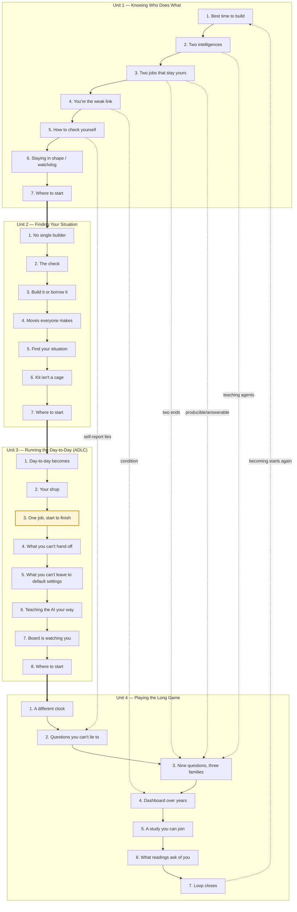

# Playbook End-to-End View

*A working artifact, not a settled spec. Companion to [conceptual-playbook-outline.md](curriculum/outlines/conceptual-playbook-outline.md) and the four unit outlines. Built so the whole architecture can be read at a glance before structural decisions inside any single unit are revisited.*

This view shows: (a) the linear spine — Units 1, 2, and 4 carry 7 lessons each; **Unit 3 carries 8** (the two-lesson pair *What You Can't Hand Off* + *What You Can't Leave to Default Settings* refuses the agent's two silent defaults and is deliberately not compressed into one lesson); (b) the cross-cutting threads that seed in Unit 1, bloom in Units 2-3, and harvest in Unit 4; and (c) the loop close — *Remaining* feeds back into *Becoming* on the next build.

It does **not** show: the audience modularity branch inside Unit 2 (each situation configuring a different Unit 3 experience). That belongs in a second diagram if we ever need it; this one is the universal spine.

---

## End-to-end ToC

Each lesson shown with its "what you get" promise from the current unit outlines.

### Unit 1 — Knowing Who Does What
*Install the stance and nothing more. By the end you know what the AI is for, what you are for, and why that line is the most valuable thing you own.*

- **Lesson 1 — Why This Is the Best Time to Build (and Why It's on You):** See the opportunity clearly; understand why you're the one who wins or loses it.
- **Lesson 2 — Two Kinds of Intelligence at the Table:** Stop competing with the AI; start directing it.
- **Lesson 3 — The Two Jobs That Stay Yours Forever:** Your worth won't vanish with the next model release — these two jobs never transfer.
- **Lesson 4 — The Catch: You're the Weak Link Now (and That's Fixable):** Spot when you're the problem — the quiet kind — before it costs you.
- **Lesson 5 — How to Check Yourself (Since You Can't Trust the Mirror):** An honest read on your own state, using the trick you already use on every system but yourself.
- **Lesson 6 — Staying in Shape and Building Your Own Alarm:** Keep your edge over a career; set an alarm that goes off on the days you'd ignore.
- **Lesson 7 — Where to Start Today, and How the Rest Helps You:** One thing to do on build #1; a map of everything ahead.

### Unit 2 — Finding Your Situation
*Locate the builder before prescribing anything. Get the kit built for your situation, plus permission to borrow.*

- **Lesson 1 — This Kit Doesn't Have One Builder:** Stop reading a generic playbook; start getting the one built for where you actually are.
- **Lesson 2 — The Check That Points You to Your Spot:** A short, honest read on where you stand — even though you can't grade yourself.
- **Lesson 3 — Build It, or Borrow It — Knowing Which:** The single call that saves you the most wasted effort.
- **Lesson 4 — The Moves Everyone Makes:** Five moves that go in every kit, whoever you are.
- **Lesson 5 — Find Your Situation:** The six most common spots people are stuck in — find yours, meet its kit.
- **Lesson 6 — Your Kit Isn't a Cage:** Freedom to borrow — so the playbook fits your real life.
- **Lesson 7 — Where to Start Today, and How the Rest Helps You:** One thing to do this week; a map ahead.

### Unit 3 — Running the Day-to-Day (ADLC)
*Run a full team's worth of work with a crew of agents in the middle, while you hold the two jobs at the ends, refuse the defaults that would silently make your big decisions for you, and the board keeps an honest scoreboard on whether you really did.*

- **Lesson 1 — What the Day-to-Day Becomes:** See how one person can now run the whole build — and why that doesn't change who's in charge.
- **Lesson 2 — Your Shop: Where the Work Lives, the Team, the House Rules:** Know the handful of pieces that make up an AI-run build; see your Unit 2 kit as its setup sheet.
- **Lesson 3 — One Job, Start to Finish:** Watch a single piece of work move through every step — see exactly where your hands are and where the agents' are. *(Matrix pilot in [unit-3-lesson-3-matrix.md](curriculum/outlines/unit-3-lesson-3-matrix.md).)*
- **Lesson 4 — What You Can't Hand Off:** Know the exact moments the work is yours alone — and the in-flight move (steering) that makes those moments holdable when the middle runs at machine pace.
- **Lesson 5 — What You Can't Leave to Default Settings:** Know the second default the agent has — frontier-on-every-task — and the explicit classify-and-route discipline that meets it, with open-source/self-hosted as a first-class option.
- **Lesson 6 — Teaching the AI Your Way (and the Knife-Edge Under It):** Set up your agents so they make you sharper, not softer — and the single setting that decides which. (Same setting doubles as the primary steering instrument from Lesson 4.)
- **Lesson 7 — The Board Is Watching You, Too:** See how the same system that runs your work becomes the honest scoreboard you could never keep on yourself — operating at three scales: self, agent-in-flight, work-system-reads-human.
- **Lesson 8 — Where to Start Today, and How the Rest Helps You:** One thing to set up on your next build; the map into the long game.

### Unit 4 — Playing the Long Game
*A handful of honest questions you can carry for a whole career — readings your own work takes for you — so you can see what's quietly under threat while there's still time to change course.*

- **Lesson 1 — A Different Clock:** See why winning the opportunity and keeping it are the same job on two clocks — and why almost nobody is watching the second one.
- **Lesson 2 — Questions You Can't Lie To:** Learn why the long-game questions are trends, not a test — and why the answers come from your work, not your gut.
- **Lesson 3 — The Nine Questions, in Three Families:** The nine things actually under threat over a career — grouped so you can see what each is really about.
- **Lesson 4 — Your Own Dashboard, Read Over Years:** Realize you already built this instrument in Unit 3; learn to read it on the long clock.
- **Lesson 5 — A Study You Can Join:** Learn the inquiry is one Clay runs on himself in public; see exactly what it means to point your instrument at the shared question.
- **Lesson 6 — What the Readings Ask of You:** Learn the one move the whole instrument can't make for you — and why a bad trend isn't a verdict, it's a starting gun.
- **Lesson 7 — Where to Start Today, and How the Loop Closes:** One thing to do this week; the book in a line; the loop back to *Becoming*.

---

## The five cross-cutting threads

Each thread enters as a seed in Unit 1, blooms while the builder is doing the thing it governs, and harvests in Unit 4 as a tracked reading. Bloom lessons are listed; intermediate beats live in the conceptual outline.

| Thread | Seed | Blooms in | Harvest |
|---|---|---|---|
| The two ends (origination + answerability) | S1 Lesson 3 | S2 Lesson 2, S3 Lesson 3-4 | S4 Lesson 3 (Identity, Judgment) |
| Producible / answerable split | S1 Lesson 3 | S2 Lesson 2 (as sorting key), S3 Lesson 3 (per gate) | S4 Lesson 3 (Differential, Judgment) |
| Teaching agents (transfer vs. substitute) | S1 Lesson 2 | S2 Lesson 3, S3 Lesson 6 | S4 Lesson 3 (Cognitive, Identity) |
| Condition (you are the infrastructure) | S1 Lesson 4 | S1 Lesson 5-6, S3 Lesson 7 | S4 Lesson 4 (dashboard over years) |
| Self-report lies / trailing signal | S1 Lesson 5 | S3 Lesson 7 | S4 Lesson 2 (trends, not snapshots) |
| **Steering through the middle** (the in-flight motion that holds the two jobs) | implicit S1 Lesson 3 | S3 Lesson 4 (full bloom), S3 Lesson 6 (register as steering instrument) | S4 Lesson 3 (Cognitive, Epistemic, Identity); read as reframe-vs-accept, override rate, self-spec incidence |
| **Right-sized routing** (refuse the agent's frontier-on-every-task default) | implicit S1 Lesson 4 (notice one number) | S2 Lesson 4-5 (per-audience routing posture), S3 Lesson 5 (full bloom) | S4 Lesson 3 (Economic, Ethical); read as frontier-share, cost-per-unit-per-tier, rate-limit incidence |

And the loop close: every honest reading on S4's career clock becomes a *why* on the next build's clock — *Remaining* feeds back into *Becoming*. The builder leaves S4 Lesson 7 pointed at the next S1 Lesson 1.

---

## Flowchart



The pilot-styled node (S3 Lesson 3) is the lesson the matrix outline has already drilled into.

### Rendering to PNG

If [Mermaid CLI](https://github.com/mermaid-js/mermaid-cli) is installed:

```
mmdc -i curriculum/outlines/playbook-end-to-end.md -o curriculum/outlines/playbook-end-to-end.png
```

Or paste the `mermaid` block into any Mermaid live editor.

---

## What the whole view surfaces (open questions)

These are structural observations the end-to-end view makes visible — not decisions, just things worth holding while the unit work continues.

1. **S4 Lesson 3 is the convergence point.** Three of the five threads (two ends, producible/answerable, teaching agents) all harvest there, which makes that lesson load-bearing for the whole long-game payoff. Is that concentration intentional, or a sign the harvest should be spread across more S4 lessons?
2. **Condition blooms partly inside Unit 1.** The conceptual outline says condition only *seeds* in Unit 1 and blooms in Unit 3. The current S1 outline blooms it across Lesson 4-6. Either the conceptual outline needs updating, or Unit 1 is doing too much.
3. **The 7-lesson symmetry is now broken — deliberately.** Units 1, 2, and 4 still carry 7 lessons; **Unit 3 carries 8** after the paired-discipline split of Lesson 4 (steering / what you can't hand off) and Lesson 5 (right-sized routing / what you can't leave to default settings). The asymmetry is the right structural call — both disciplines are doctrine-grade and the cost-discipline material has enough operational density to need its own lesson — but it does mean the cover-and-contents rhythm a builder sees three times in a row breaks at Unit 3. Worth confirming the call holds at draft time, or whether one of the other units wants an 8th lesson for parallelism (most plausible candidate: Unit 4 splitting Lesson 6 / Lesson 7, where the *reading vs. acting* distinction is currently somewhat diffuse).
4. **The loop close is one lesson.** S4 Lesson 7 does all the "*Remaining* feeds back into *Becoming*" work. The thread is the most important one in the book and gets the least real estate. Worth checking whether it deserves earlier setup.
5. **Modularity is invisible here.** The Unit 2 → Unit 3 branch (six audience kits configuring a single ADLC spine) is the book's most distinctive structural move and this diagram doesn't show it. If the modular branch ever needs its own picture, that's a second diagram, not a richer version of this one.
